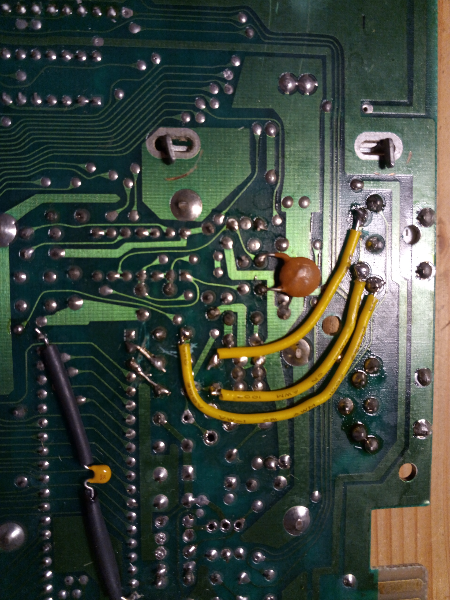
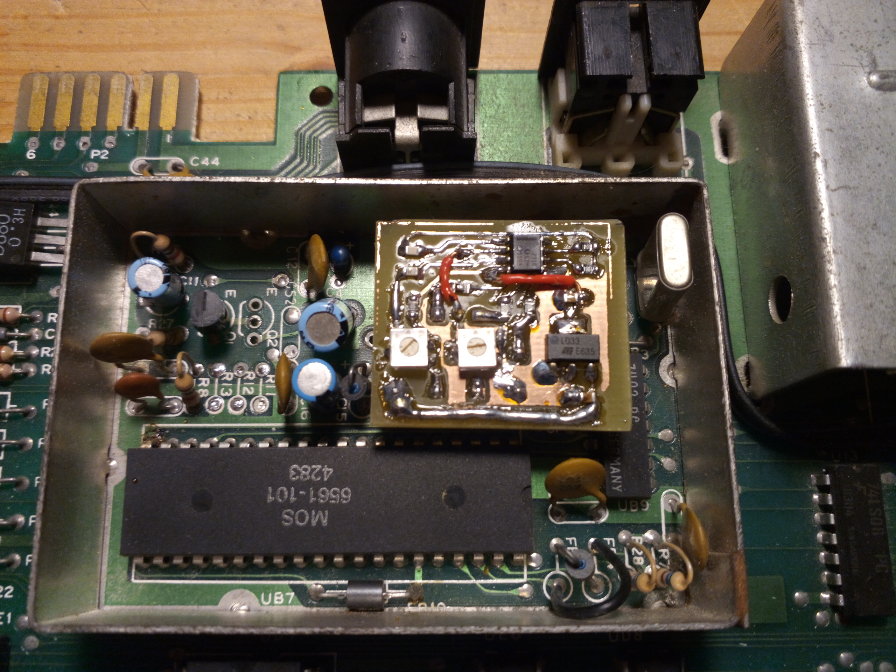

# VIC20-Video-Amplifier
Modify the analog video circuit of a VIC 20 to use modern parts

## Project intentions

My main intention here was to learn about the video generation circuitry of the VIC-20
and maybe come up with some way to interface it with a RGBtoHDMI to generate HDMI.

While I did not succeed in reliably quantizing the analog signal back to its digital
form, I did make some improvements on the overall analog circuit. 
 
## Replace original video amplifier with sockets

To make experimenting simpler, I just went and totally removed all components involved
in amplifying the video signal from the VIC. On my board (cost reduced small variant) this is realtively
easy, as the empty contact holes next to the VIC directly carry GND, +5V and both luma and chroma.
These are now broken out with a pin socket (using 4 of the 7 contacts). On the other side sockets are 
prepared to receive 3 signals to be forwarded to the A/V connector on pin 1, 4 and 5. 

## Cabling on the underside

Using 3 now unused holes (all parts are removed here so the traces do not matter) the pin sockets
on the front side are forwarded with wires to the A/V connector. Also the PCB trace between 
pin 4 and pin 5 under the connector and between pin 1 and 5V had to be cut. 

## Insert an amplifier PCB

I designed a PCB that carries a modern video amplifier IC and its supporting passive components to
fit the prepared pin sockets. 

Two trimmer potentiometers are provided to independently adjust the brightness and the color saturation.

A voltage regulator is used to get a stable reference voltage to drive the VIC's luma output DAC. 
This should provide the most noise-free signal possible.
 
## Modified A/V pinout

| Pin  | Signal    |
| ---- | --------- |
| 1    | Luminance |
| 2    | Ground    |
| 3    | Audio     |
| 4    | Composite |
| 5    | Chroma    |
